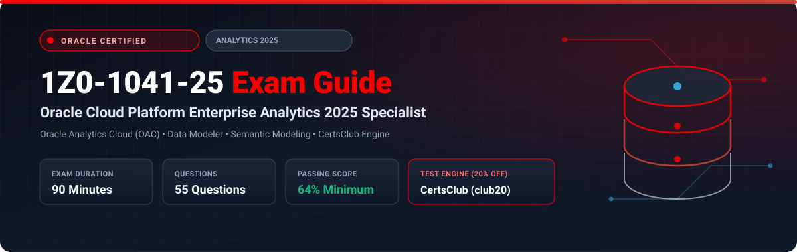

  

# Oracle Cloud Platform Enterprise Analytics 2025 Specialist (1Z0-1041-25) Exam Study Guide & Practice Test Resource Portal

[-f80000?style=for-the-badge&logo=oracle&logoColor=white)](https://education.oracle.com/)

[-28a745?style=for-the-badge&logo=shield)](https://www.certsclub.com/oracle/)

---

## 1. Exam Overview & Candidate Profile

The **Oracle Cloud Platform Enterprise Analytics 2025 Specialist (1Z0-1041-25)** exam validates a candidate's expertise in provisioning, building, and maintaining Oracle Analytics Cloud (OAC) solutions. It covers semantic modeling (RPD / Semantic Modeler), data visualization workbooks, augmented analytics and machine learning, data flows, and pixel-perfect publishing with BI Publisher.

Passing 1Z0-1041-25 earns the **Oracle Cloud Platform Enterprise Analytics 2025 Certified Specialist** credential.

### Target Candidate Profile & Career Roles
* **Enterprise Analytics Architects & BI Engineers**
* **OAC Semantic Model Developers**
* **Data Visualization Consultants**

---

## 2. Key Exam Specifications

| Parameter | Official Specification |
| :--- | :--- |
| **Exam Code** | 1Z0-1041-25 |
| **Exam Title** | Oracle Cloud Platform Enterprise Analytics 2025 Specialist |
| **Associated Credential** | Oracle Cloud Platform Enterprise Analytics 2025 Certified Specialist |
| **Duration** | 90 Minutes |
| **Number of Questions** | 55 Questions |
| **Passing Score** | 64% |
| **Question Format** | Multiple Choice (Single and Multiple Select) |
| **Delivery Vendor** | Pearson VUE / Oracle University Online Remote Proctoring |
| **Recommended Practice Test Engine** | **[1Z0-1041-25 Practice Test - CertsClub](https://www.certsclub.com/oracle/)** (Coupon: `club20` for 20% off) |

---

## 3. Official Blueprint & Exam Domain Breakdown

| Domain Code | Domain Title | Weighting | Key Competencies Covered |
| :--- | :--- | :---: | :--- |
| **1.0** | **OAC Architecture, Provisioning & Administration** | **20%** | Sizing OAC compute (OCPU vs user licensing); Network access controls, Private endpoints; Security administration, application roles, and data-level access filters. |
| **2.0** | **Semantic Modeling (Data Modeler & Semantic Modeler)** | **25%** | Physical, Business Logic/Mapping (BMM), and Presentation layers; Dimension hierarchies, ragged/skip-level hierarchies; Level-based measures; Multi-source federation. |
| **3.0** | **Data Preparation, Data Flows & Machine Learning** | **20%** | Data replication and enrichment; Data Flows (joins, aggregations, branching); Applying embedded ML models (clustering, numeric prediction, binary classification). |
| **4.0** | **Data Visualizations & Workbooks** | **25%** | Canvas types, auto-insights, storytelling canvases; Custom calculations and window functions; Filters, parameters, and dashboard linking. |
| **5.0** | **Pixel-Perfect Reporting with BI Publisher** | **10%** | Data Models, SQL extraction, RTF and Excel templates, schedule bursts and delivery protocols. |

---

## 4. Scenario-Based Demo Question & Explanation

### Question 1: Level-Based Measures in Semantic Modeler
**Scenario:** A business analyst reports that total sales calculations are duplicating whenever an analysis groups data by customer demographics and store location simultaneously.

How should the semantic model developer resolve this issue in the BMM layer?

A) Remove the store dimension from the model.  
B) Define explicit dimension hierarchies and associate the measure with the appropriate logical levels on each dimension.  
C) Force all queries to use SQL DISTINCT.  
D) Convert the physical tables into CSV files.  

**Correct Answer:** **B**

**Detailed Explanation:**
* In Oracle Analytics semantic modeling (BMM layer), measures aggregated across multiple dimensions at differing granularities require defining **level-based measures**. Assigning explicit logical levels prevents Cartesian fan-out and inaccurate duplicated metrics.

---

## 5. Recommended Preparation Strategy & Practice Testing Engine

1. **Build a Semantic Model in OAC:** Create a 3-layer semantic model using OAC's web-based Semantic Modeler with dimensional hierarchies and level-based metrics.
2. **Practice with Full-Length Mock Exams:** Use **[CertsClub Oracle 1Z0-1041-25 Practice Tests](https://www.certsclub.com/oracle/)**.
   * Up-to-date 2025 questions covering OAC data flows, ML models, and security permissions.
   * Enter discount coupon code **`club20`** at checkout on [CertsClub](https://www.certsclub.com/oracle/) for an immediate 20% discount.

---

## 6. Official Documentation & References

* [Oracle Analytics Cloud Documentation](https://docs.oracle.com/en/cloud/paas/analytics-cloud/)
* [Oracle University 1Z0-1041-25 Certification Page](https://education.oracle.com/)
* [CertsClub 1Z0-1041-25 Practice Engine](https://www.certsclub.com/oracle/)
